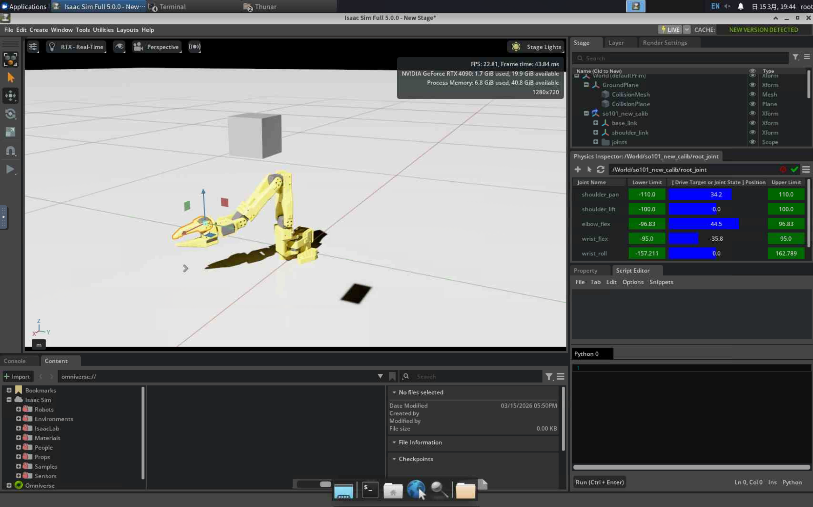
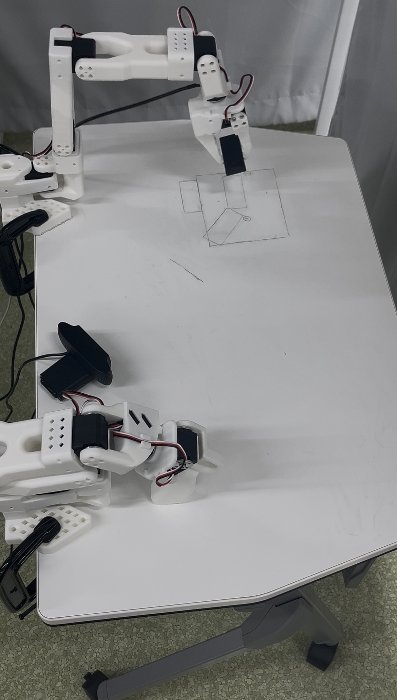

# Isaac Sim Robot Arm Demo

A basic robot arm control experiment built with Isaac Sim.

## Overview

This project is a simple practice project for robot arm simulation control.

It focuses on understanding:
- robot model loading
- joint control through Python scripts
- basic simulation workflow in Isaac Sim

## Simulation

Robot arm running in NVIDIA Isaac Sim.

## Real Robot

SO101 robotic arm used for imitation learning experiments.

## Environment

- Isaac Sim
- Python

## Current Work

- Loaded robot arm model in simulation
- Ran a basic control script
- Observed joint behavior in simulation

## Future Work

- add task-oriented manipulation control
- integrate perception modules
- explore imitation learning pipelines
- experiment with reinforcement learning for robot manipulation

## Project Structure
isaac-sim-robot-arm-demo
│
├── run_demo1.py # Basic robot arm control script
├── README.md # Project description
└── images
├── isaac_sim.png # Simulation screenshot
└── so101_robot.jpg # Real robot setup
